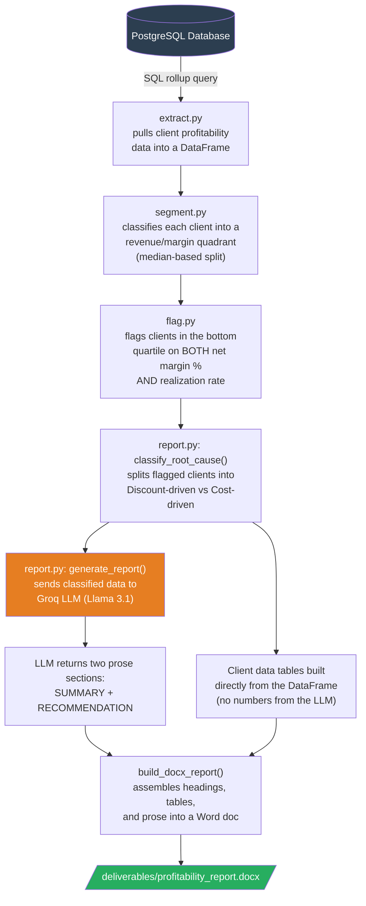

# Client-profitability-analytics
SQL + Python pipeline that analyzes client-level profitability for a professional services firm-modeling fee realization, staffing cost, and margin drag to automatically flag underpriced or unprofitable clients and generate a partner-ready action memo.

This project goes beyond top-line revenue to answer the question that actually drives business decisions: which clients are we truly making money on, once staffing cost, fee discounting, and overhead are factored in - and why?

Using a synthetic dataset modeled on real audit/advisory engagement economics (negotiated fixed fees, staff time entries, billing vs. cost rates, quarterly overhead), the project builds a full automated pipeline: SQL rolls up granular time-entry data to the client level, Python segments and flags underperforming clients, an LLM synthesizes the findings into prose, and the result is assembled into a formatted Word document — no manual steps required after running one script.

## Business Question
Which clients and engagements are actually profitable once you account for the true cost of serving them — negotiated fee discounts, actual staffing cost, and overhead — not just top-line revenue? Where should the firm reallocate capacity, repricing, or scope?

## Data
Synthetic dataset built to mirror how a professional services firm (audit/advisory/consulting) tracks engagements. Data is randomly generated but structured to reflect realistic dynamics: fixed-fee engagements negotiated below or above standard list-rate value, variable staff realization (over/under budgeted hours), and quarterly overhead allocation.
| File | Rows | Description |
| --- | --- | --- |
| data/clients.csv | 40 | Client roster-industry, region, relationship tenure |
| data/staff.csv | 212 | Staff roster-level, billing rate, fully-loaded cost rate |
| data/engagements.csv | 81 | Projects per client-negotiated fee vs. standard value at list rates |
| data/time_entries.csv | 14,560 | Weekly hours logged per staff member per engagement, with billed and cost amounts |
| data/overhead_allocation.csv | 320 | Quarterly overhead allocation allocated per client |

## Pipeline

### 1. SQL analysis
(sql/profits/profitability_analysis.sql)
A layered CTE query joining time entries → engagements → clients → quarterly overhead, producing one row per client with revenue, cost, gross margin %, net margin % (after overhead), and realization rate (negotiated fee vs. standard list-rate value).

### 2. extract.py
Connects to PostgreSQL via SQLAlchemy and returns the SQL rollup as a DataFrame. Credentials load from a gitignored .env file; paths are resolved relative to the script itself, so it runs correctly regardless of working directory.

### 3. segment.py
Classifies every client into a revenue/margin quadrant (e.g. "High Revenue / Low Margin" — the revenue-trap segment) using median splits computed from the dataset itself, so the cutoffs adapt automatically rather than relying on arbitrary fixed numbers.

### 4. flag.py
Flags the clients that are genuinely underperforming: both net margin % and realization rate in the bottom quartile of the dataset (an AND condition, chosen deliberately to surface only severe cases rather than casting a wide net). Thresholds are computed from .quantile(0.25) on the data itself for the same reason as the segmentation cutoffs.

### 5. report.py
The automation layer:
  1. Classifies each flagged client's root cause — "Discount-driven" (realization < 100%, the fee itself is underpriced) vs. "Cost-driven" (realization ≥ 100%, so the margin problem is staffing cost, not pricing)
  2. Sends the classified data to a free LLM API (Groq, openai/gpt-oss-120b) with a prompt constrained to return only two prose sections — a summary and a prioritized recommendation — while every number in the report is pulled directly from the DataFrame, not generated by the model, eliminating any risk of the LLM misreporting a figure
  3. Assembles everything into a formatted .docx via python-docx: real headings, two data tables (one per root-cause group), and the LLM-written prose — saved to deliverables/profitability_report.docx
  
## Key Finding:
Of the clients flagged as underperforming, the large majority (7 of 8) are discount-driven — margins are actually healthy, but fees were negotiated below the standard value of work delivered, dragging down realization. Only one client is cost-driven, where the fee is fair but staffing cost is eroding margin. This points to a firm-wide pricing/discounting issue rather than a staffing problem: the recommended first move is a repricing review across the discount-driven group, not a staffing audit.

## Design Decisions
1. Data-driven thresholds throughout — segmentation and flagging cutoffs are computed from the dataset (medians, quartiles) rather than hardcoded, so they hold up if the underlying data changes.
2. Root-cause split uses a fixed, meaningful boundary (100% realization) rather than another quantile — because "paying at or above standard value" is a real business threshold, not a relative one.
3. The LLM only writes prose, never numbers — the report's tables are built directly from the DataFrame; the model is prompted to return two structured text sections only, keeping every figure in the final document verifiably accurate.
4. Each pipeline stage is a pure function — extract → segment → flag → report, each taking and returning a DataFrame (or dict), independently testable and importable, mirroring how the stages are actually orchestrated in report.py's __main__ block.

## Setup
python -m venv venv
source venv/Scripts/activate      # Windows (Git Bash)
# venv\Scripts\activate           # Windows (Command Prompt)
# source venv/bin/activate        # Mac/Linux

pip install -r requirements.txt
cp .env.example .env              # then fill in your DB credentials + GROQ_API_KEY

## Repo Structure
1. Data/ raw source tables (CSV)
2. SQL queries/ SQL rollup query
3. python/ extract.py, segment.py, flag.py report.py
4. deliverables/ generated Word report

## Tools
SQL (PostgreSQL), Python (pandas, NumPy, SQLAlchemy, python-docx), Groq API (openai/gpt-oss-120b)

